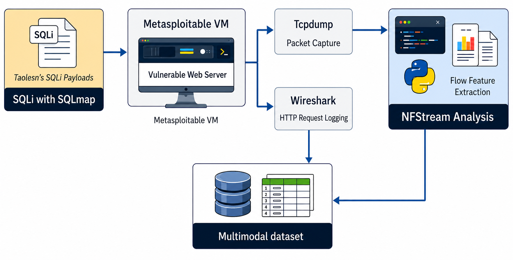

# MWAD: A Multimodal Web Attack Dataset for AI-Driven SQL Injection Detection

## Overview

The **Multimodal Web Attack Dataset (MWAD)** is a labelled cybersecurity dataset developed to support research into artificial intelligence and machine learning approaches for detecting SQL injection attacks.

MWAD contains **1,000 samples**, comprising:

- **500 benign web traffic samples**
- **500 SQL injection attack samples**

Each sample combines two complementary data modalities:

1. **HTTP request data**, representing the content and structure of web requests.
2. **Network-flow features**, representing the behavioural characteristics of the corresponding network traffic.

By combining request-level and flow-level information, MWAD supports the development and evaluation of multimodal cyberattack-detection frameworks.

---

## Dataset Generation Pipeline

The dataset was generated in a controlled private-network environment using a vulnerable web server hosted on a **Metasploitable virtual machine**.

SQL injection attacks were executed using **SQLMap** and SQL injection payloads. The resulting traffic was collected and processed using the following tools:

- **Wireshark** for HTTP request logging
- **Tcpdump** for packet capture
- **NFStream** for network-flow feature extraction

The HTTP request data and corresponding flow-level features were subsequently labelled and combined to produce the final multimodal dataset.

<p align="center">
  
</p>

<p align="center">
  <em>Figure 1. MWAD generation pipeline showing SQL injection execution, HTTP request collection, packet capture, flow-feature extraction and multimodal data integration.</em>
</p>

---

## Dataset Composition

| Class | Number of samples | Description |
|---|---:|---|
| Benign | 500 | Legitimate web requests and their corresponding network-flow features |
| SQL injection attack | 500 | SQL injection requests and their corresponding network-flow features |
| **Total** | **1,000** | Labelled multimodal web-traffic samples |

The balanced class distribution supports controlled evaluation of binary SQL injection detection models.

---

## Data Modalities

### HTTP Request Modality

The HTTP modality contains request-level information generated during interactions with the vulnerable web application.

This modality can support:

- textual analysis of HTTP requests
- malicious payload detection
- token-based machine learning
- deep learning and transformer-based modelling
- self-supervised representation learning

### Network-Flow Modality

The network-flow modality contains statistical and behavioural features extracted from captured traffic using NFStream.

This modality can support:

- traffic-flow classification
- anomaly detection
- behavioural attack analysis
- conventional machine learning
- multimodal fusion with HTTP request representations

---

## Key Features

- Publicly available multimodal cybersecurity dataset
- Contains paired HTTP-request and network-flow information
- Includes clearly labelled benign and SQL injection traffic
- Balanced dataset containing 500 samples in each class
- Generated through controlled SQL injection experiments
- Supports reproducible cybersecurity research
- Suitable for unimodal and multimodal model evaluation
- Applicable to machine learning, deep learning and self-supervised learning

---

## Research Applications

MWAD may be used for research involving:

- SQL injection attack detection
- Web application security
- Intrusion detection systems
- Network-traffic classification
- HTTP request analysis
- Multimodal machine learning
- Feature-level or decision-level data fusion
- Self-supervised cybersecurity learning
- Comparative evaluation of request-based and flow-based detection
- Cybersecurity education and laboratory demonstrations

---

## Dataset Novelty

Many web-attack datasets provide either application-layer request information or network-level traffic features separately.

MWAD was developed to provide **paired application-layer and network-flow representations of the same web interactions**. This enables researchers to examine whether combining the two modalities improves SQL injection detection compared with relying on either modality independently.

The dataset therefore provides a reusable research resource for investigating multimodal learning and data-fusion strategies in web-attack detection.

---

## Associated Publication

This dataset underpins research accepted for publication in:

> **Intelligent Systems with Applications**, Elsevier.

The complete bibliographic citation and publication DOI will be added when the article becomes available online.

### Temporary citation

Until the final publication details are available, the dataset may be referenced as:

```text
Yeboah, P. MWAD: A Multimodal Web Attack Dataset for AI-Driven
SQL Injection Detection. GitHub repository, [Year].
